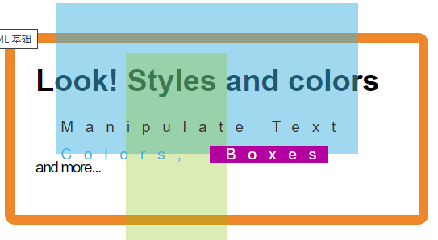

# HTML基础简介

HTML（HyperText Markup Language，超文本标记语言）

- 是一种用于创建网页的标准标记语言，而非编程语言。
- 标记语言是一套**标记标签**（Markup tag）。
- HTML使用标签来描述网页。
- HTML文档包含标签及文本内容。
- HTML文档也叫web页面。

中文网页需要使用`<meta charset="utf-8">`声明编码，否则会出现乱码。

HTML文档后缀名为`.html`、`.htm`，以上两种没有区别都可以使用。

# HTML标签

```html
<!DOCTYPE html> <!-- 声明文档，不区分大小写 -->
<html><!-- 根元素 -->
    <head><!-- 包含了文档的元（meta）数据 -->
        <meta charset="utf-8">
        <title>HTML笔记第一章</title>
        <body>
            <h1>一级标题</h1><!-- 共1-6,6级标题 -->
            <p>
                段落标签
            </p>

            <a href="https://www.runoob.com/html/html-basic.html">HTML简介</a><!-- 超链接 -->
            <!-- 图像标签 -->
            <br><!-- 换行 -->
            <hr><!-- 水平线 -->

            
        </body>
    </head>
</html>
```

# HTML属性

HTML元素可以设置属性并添加附加信息，一般在开始标签描述，以键值对的形式出现。

```html
<a href="https://www.runoob.com/html/html-attributes.html" target="_blank">HTML属性</a>
<!-- 属性值始终都在括号内，不区分单双引号，但不能同时使用 -->
```
`a`标签中的`target`属性定义在何处显示，比如`target="_blank"`会在新窗口打开

HTML代码中连续的空行只会显示为一个空格。

# HTML文本格式化

**加粗文本**

*斜体文本*

```
电脑自动输出
```

这是 下标 和 上标

| 标签   | 描述         |
| :----- | :----------- |
| b      | 定义粗体文本 |
| em     | 定义着重文字 |
| i      | 定义斜体字   |
| small  | 定义小号字   |
| strong | 定义加重语气 |
| sub    | 定义下标字   |
| sup    | 定义上标字   |
| ins    | 定义插入字   |
| del    | 定义删除字   |

# HTML `<head></head>`

`<head></head>`元素包含头部标签元素，比如可以插入脚本`scripts`、样式文件`css`以及各种meat信息。

`<base>`描述页面中所有链接的默认链接

`<link>`定义文档与外部资源的关系，通常用于链接到样式表`css`

`<meta>`标签提供了元数据，不显示但会被浏览器解析

# HTML样式-CSS

CSS（Cascading Style Sheets）用于渲染HTML元素标签的样式



- 内嵌
- 内部样式表
- 外部引用

# HTML图像 img

 标签，源属性src，src指source，它的值是11图像URL地址。alt属性用于定义可替换文本，当无法加载时显示失去的信息。

``

另外，<map>可定义图像地图，<area>可定义图像地图中可点击的区域。

# HTML表格 table

`<table>`可定义表格，`<th>`用于表头，`<td>`用于单元格，`<tr>`换行

# HTML列表

- 无序列表`<ul></ul>`

- 有序列表`<ol></ol>`

- 自定义列表`<dl></dl>`

  ```html
  <ul>
      <li>Coffee</li>
      <li>Milk</li>
  </ul>
  
  <ol>
      <li>first</li>
      <li>second</li>
  </ol>
  
  <dl>
      <dt>列表项</dt>
      <dd>名称</dd>
  </dl>
  ```

# HTML区块 `<div> <sapn>`

| 标签            | 描述                                        |
| :-------------- | :------------------------------------------ |
| `<div></div>`   | 定义了文档的区域，块级 (block-level)        |
| `<sapn></span>` | 用来组合文档中的行内元素， 内联元素(inline) |

# HTML表单与输入

`<form></form>`是一个包含表单元素的区域，允许用户输入内容，如文本（textarea）、下拉列表（select）、单选复选框（radio/checkboxes）。

`submit`提交按钮会在表单动作属性定义对文件输入数据的处理。

```html
<form>
    文本域：<input type="text">
    密码字段：<input type="password">
    单选按钮：<input type="radio">
    复选框：<input type="checkbox">
    提交按钮：<input type="submit">
</form>
```


1111

